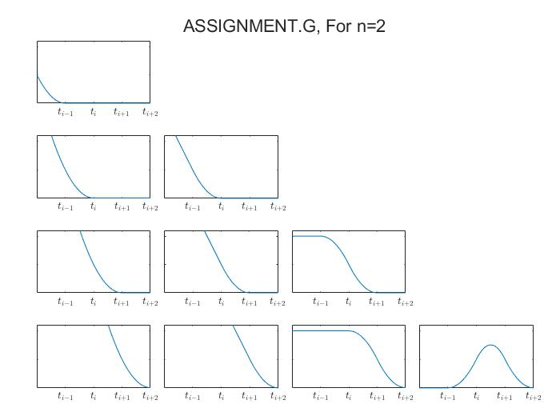

<h1 align = "center">Homework-3</h1>

<center>张卓涵</center>
<center>3190101161</center>

## 文件结构说明

```mermaid
graph LR
Spline-->A(bin)-->二进制可执行文件
Spline-->B(include)-->程序所需的头文件
Spline-->C(output)-->bin中文件执行后的结果,通过重定向输出到txt文件中
Spline-->D(plot)-->*.m文件是绘图用的matlab程序
D-->figure-->*.jpg是题目对应的图像
Spline-->E(src)-->题目对应的.cpp文件
Spline-->F(test)-->测试所需相关文件
Spline-->G(doc)-->作业报告与相关依赖文件
Spline-->run.sh-->一个shell脚本,用于运行生成的可执行文件
```

## 本地环境
代码作者本地具有以下环境和软件：
+ Ubuntu 18.04
+ g++(GCC) 11.2.0 (C++20)
+ LAPACK 3.10.0
+ GNU Make 4.1

## 编译与运行

编译：

+ 执行`make`将在`bin`文件夹中生成对应的可执行文件;
+ 执行`make test`将在`bin`文件夹下生成测试文件对应的可执行文件`test`;
+ 执行`make latex`将编译`.tex`文件，生成pdf报告;
+  执行`make clean`清除生成的所有可执行文件和`output`下所有的存放输出结果的txt文件;

运行：

+ 执行`bash run.sh`将通过shell的重定向方法，把程序的运行结果输出到`output`文件夹下的txt文件中;

## 类与方法说明

#### Polynomial类与方法

+ Polynomial实现了作业要求里的所有方法，以及重载了`+ -`即多项式的正负。`output`函数是为习题F准备，用于把系数为向量的多项式按照不同维度的分量输出出来。

#### Spline类与方法

+ 在构造Spline类的时候采用了类模板特化，将ppForm和cardinalB两种不同的样条分开实现。同时为了测试方便，将多项式成员变量声明为了`public`

    ```cpp
    template<int Dim, int Order, SplineType st, class CoefType, class KnotType>
    class Spline
    {
    	...
    };
     /* ppForm特化 */
    template<int Dim, int Order, class CoefType, class KnotType>
    class Spline<Dim,Order,ppForm,CoefType,KnotType>
    {
        ...
    };
    /* cardinalB特化 */
    template<int Dim, int Order, class CoefType, class KnotType>
    class Spline<Dim,Order,cardinalB,CoefType,KnotType>
    {
    	...
    };
    ```

    这样做的好处是，二者具有不同的方法和重载，可以将这些方法分开来，更清晰明确。
    
+ ppForm Spline

    + 声明了友元函数

      ```cpp
      template<int Ord>
      friend Spline<1,Ord,ppForm,double,double> interpolate(const InterpConditions &interp, BCType t);
      ```

      用于生成一维的ppForm样条，其中通过模板特化分别实现了Ord=4,2时的情况。

      当Ord=4时，参数`t`是`complete`时，传入的`interp`要保证其在两个端点处有相应的一阶导数。

    + 友元函数

      ```cpp
      template<int Ord>
      friend Spline<2,Ord,ppForm,Vec<double,2>,double> fitCurve(const std::vector<Vec<double,2>> &vec, BCType type);
      ```

      用于生成二维ppForm样条，其中通过模板特化分别实现了Ord=4,2时的情况。

      当生成`complete`样条时，默认参数`vec`的头一个和最后一个元素分别是第二个和倒数第二个点对应的导数。

    + 重载了()运算，用于求值

      ```cpp
      template<class T>
      auto operator()(const T &x)
      ```

    + 友元函数

      ```cpp
      template<int dim, int ord>
      friend void output(const Spline<dim,ord,ppForm,Vec<double,dim>,double> &p);
      ```

      是为习题F准备，结合`Polynomial`类里的同名函数，将二维样条按照不同维度的分量输出出来，以便在matlab中完成图像绘制。

+ cardinalB Spline

    + 实现了对B样条的加减法和数乘的重载

      ```cpp
      /* 加减法 */
      #define OPERATION_ADD_SUB(OpNm,Op) 
      auto OpNm(const Spline<Dim,Order,cardinalB,CoefType,KnotType> &p) const
      {
          ...
      }
      OPERATION_ADD_SUB(operator+, +)
      OPERATION_ADD_SUB(operator-, -)
      #undef OPERATION_ADD_SUB
      /* 多项式乘和数乘 */
      template<int num>
      auto operator*(const Polynomial<num,CoefType> &p);
      template<class T>
      auto operator*(const T &p);
      ```

    + 通过递归方法实现生成B样条的函数`Generate()`

      ```cpp
      template<int n>
      friend Spline<1,n,cardinalB,double,double> Generate(int i);
      ```

    + 生成一维B样条的方法

      ```cpp
      template<int Ord>
      friend Spline<1,Ord,cardinalB,double,double> interpolate(const InterpConditions &interp);
      ```

      通过模板特化，分别实现Ord=3,2（即对应Corollary 4.58 和 4.59）时的情形。

## 习题报告

*作业题报告同样可见于*`./doc/document.pdf`

### Assignment.B

+ 程序输出结果见`./output/exercise_B.txt`，运行图像如下：

  

+ 相应的误差向量的max-norm为：

  ```cpp
  When n = 10:
  Error for complete cubic spline: 0.0205289
  Error for notAknot cubic spline: 0.0205334
  When n = 20:
  Error for complete cubic spline: 0.00316894
  Error for notAknot cubic spline: 0.00316894
  When n = 40:
  Error for complete cubic spline: 0.00012413
  Error for notAknot cubic spline: 0.00012413
  When n = 80:
  Error for complete cubic spline: 7.04042e-06
  Error for notAknot cubic spline: 7.04042e-06
  ```

  可以看到收敛速度几乎是一致的。


### Assignment.C & D

+ 习题C运行图像如下：

  

+ 习题D的输出结果为：

  ```cpp
  For the corollary 4.58:
     E(-3.5) = 0.000669568
     E(-3) = 0
     E(-0.5) = 0.0205289
     E(0) = 1.11022e-16
     E(0.5) = 0.0205289
     E(3) = 6.66134e-16
     E(3.5) = 0.000669568
  For the corollary 4.59:
     E(-3.5) = 1.249e-16
     E(-3) = 0.00141838
     E(-0.5) = 0
     E(0) = 0.120238
     E(0.5) = 0
     E(3) = 0.00141838
     E(3.5) = 1.249e-16
  ```

  有些误差非常接近机器精度是因为，这些点本身就是选取的“knots”，这些点处的误差本应是0，只是在计算中保留为了机器精度。

  从图像上看，显然符合Corollary 4.58的三次样条更精确。

### Assignment.E

+ 在选点时，先把原方程化为了极坐标方程
  $$
  r = \sqrt{\frac{3}{(\frac{1}{4}sin\theta-3|cos\theta|)sin\theta+2}}
  $$
  再把$[0,2\pi]$这个区间等分为n份，获得对应点的极坐标，再转化为直角坐标即可
  
+ 心形线绘制如下：

  


### Assignment.F

+ 程序运行结果绘制出的图像如下：

  

### Assignment.G

+ n=1时，

  

+ n=2时，

  

## 测试报告

测试报告请看[这里](./test/README.md)

